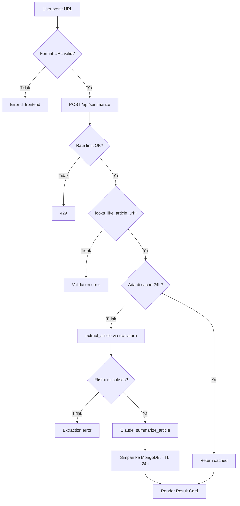
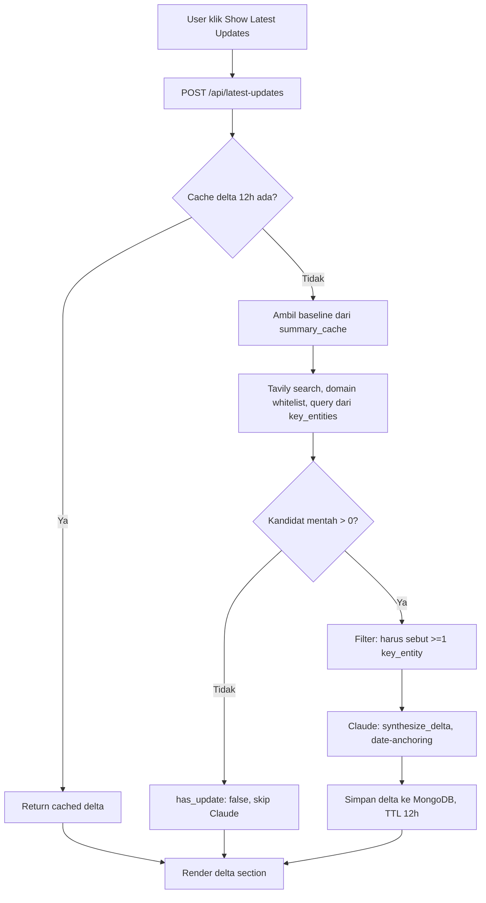

# News Summarizer

## Ringkasan

Aplikasi web yang mengubah artikel berita menjadi ringkasan terstruktur (10 bagian: executive summary, key points, root cause, rekomendasi, sentiment/bias, 5W1H, referensi, confidence level) dan opsional menarik pembaruan terkini (delta) dari sumber lain. Dibangun sebagai proyek portofolio software engineering.

## Latar Belakang / Problem Statement

Mencari berita utuh sering berarti membuka banyak tab di portal berbeda untuk mendapat gambaran lengkap suatu isu. Aplikasi ini mengotomatiskan proses itu: satu URL masuk, sistem mencari topik/entitas yang sama dari sumber lain dan menyusunnya jadi satu analisis.

## Scope

### In Scope (V1)

- Satu halaman responsif: Navigation, Hero, Result Card, Recent News (feed publik), About, Footer
- Input satu URL artikel → ringkasan terstruktur 10 bagian
- Latest Updates (delta) on-demand — dipicu klik eksplisit, bukan otomatis
- Bilingual (Indonesia default, terjemahan Inggris on-demand)
- Light/Dark theme
- Export PDF, Word, Copy, Share (Browser Share API)
- Rate limiting per-IP tanpa autentikasi

### Out of Scope (Sengaja Tidak Dibangun)

- Login, registrasi, autentikasi, profil pengguna
- Dashboard, admin panel, CMS
- Riwayat personal, bookmark, notifikasi
- Payment/subscription
- Chat/comment

Batasan ini disengaja untuk menjaga V1 tetap ringan. Bukan keterbatasan teknis — arsitektur dirancang supaya fitur ini bisa ditambah di V2 tanpa refactor besar (lihat catatan di `Architecture.md`).

## MVP Definition

MVP dianggap tercapai jika:

1. Satu URL artikel berita valid → hasil 10 bagian terstruktur, tanpa AI mengarang fakta yang tidak ada di sumber
2. Extraction gagal (paywall/bot-blocked/JS-rendered) ditangani dengan pesan yang jelas, bukan crash
3. Latest Updates hanya menampilkan perkembangan yang genuinely terjadi setelah tanggal publikasi artikel asli (date-anchored), bukan sekadar topik serupa
4. Aplikasi tidak bisa disalahgunakan untuk menghabiskan biaya API tanpa batas (rate limiting + caching + on-demand triggers)
5. Deploy publik dengan URL yang bisa diakses dan didemokan ke recruiter

## Goals

**Goal produk:** menyelesaikan masalah nyata (informasi berita terpencar di banyak sumber) dengan cara yang jujur secara epistemik — AI tidak boleh terlihat lebih yakin dari data yang tersedia.

**Goal portofolio:** menunjukkan kemampuan engineering di luar sekadar "panggil AI API" — pengambilan keputusan arsitektur (cost control, caching strategy, validasi berlapis), debugging produksi nyata, dan dokumentasi teknis yang rapi.

**Non-goals:** bukan bertujuan jadi produk komersial atau menangani traffic skala besar — desain sengaja dioptimalkan untuk skala portofolio (rendah-traffic, tanpa akun pengguna).

## Technical Requirements

| Kategori | Requirement |
|---|---|
| Performance | Response time ringkasan < 15 detik untuk artikel ukuran normal (di luar cold-start hosting) |
| Availability | Live demo dapat diakses publik; toleransi cold-start jika pakai hosting gratis |
| Cost control | Tidak ada AI call otomatis di luar aksi eksplisit pengguna; cache untuk hindari duplikasi biaya |
| Security | Tidak ada PII disimpan; API key hanya di environment variable, tidak pernah di-commit |
| Reliability | Kegagalan di satu layanan eksternal (Tavily/ekstraksi) tidak boleh membuat seluruh request crash — selalu terkontrol jadi pesan error yang jelas |
| Accessibility | Responsive dari mobile sampai desktop; kontras warna cukup di light & dark mode |
| Bahasa | Output default Bahasa Indonesia, terjemahan Inggris on-demand |

## Success Metrics

*(Catatan: proyek ini tidak punya traffic bisnis riil, jadi metrik berikut kombinasi teknis-terukur dan tujuan portofolio, bukan metrik bisnis.)*

**Metrik teknis:**
- Cache hit rate untuk summary (indikasi caching bekerja, bukan mubazir generate ulang)
- Rasio error ekstraksi vs sukses per submission (indikasi kualitas validasi & extractor)
- Rasio `has_update: true` vs `false` pada Latest Updates (indikasi apakah entity+date filter terlalu ketat atau wajar)

**Metrik portofolio:**
- Live demo dapat didemokan end-to-end tanpa error ke reviewer/recruiter
- Source code + dokumentasi teknis (`Architecture.md`, `Schema.md`, dll) cukup lengkap untuk dijelaskan tanpa perlu buka kode saat wawancara
- Ada jejak keputusan desain yang bisa diceritakan (trade-off cost vs fitur, kejujuran AI, dll) — bukan cuma "aplikasi jadi"


## Tech Stack

| Layer | Teknologi | Kenapa |
|---|---|---|
| Frontend | React 19 + Tailwind CSS | SPA ringan, utility-first styling cocok untuk desain minimalist-mono yang dipilih |
| Backend | Python + FastAPI | Async native (cocok untuk I/O-bound: panggil Claude, Tavily, MongoDB bersamaan), validasi request built-in via Pydantic |
| Ekstraksi Artikel | trafilatura + fallback User-Agent browser | Library ekstraksi konten paling reliable untuk HTML artikel; fallback UA diperlukan karena banyak situs berita block default UA `trafilatura`/scraper |
| Analisis AI | Claude Sonnet 4.5 (Anthropic) | Reasoning terstruktur kuat, cocok untuk output JSON schema kompleks; direkomendasikan Emergent sendiri untuk "structured analysis & reasoning" |
| Pencarian Berita | Tavily Search API | Search API yang didesain untuk kebutuhan AI/news retrieval, bukan general web search — hasil lebih relevan untuk kasus ini dibanding Google-proxy generik |
| Database | MongoDB (Motor, async) | Skema fleksibel cocok untuk dokumen JSON kompleks (hasil Claude) tanpa migration overhead; tidak butuh relasi kompleks yang mengharuskan SQL |
| Hosting | Emergent.host | Preview + production, terintegrasi dengan dev environment |

**Catatan lock-in:** backend memakai `emergentintegrations` (wrapper proprietary Emergent) dan `EMERGENT_LLM_KEY`, bukan Anthropic SDK resmi. Migrasi ke hosting lain mensyaratkan rewrite ke `anthropic` SDK + API key Anthropic langsung sebagai prasyarat.

## Struktur Folder

```
├── backend/
│   ├── server.py          # FastAPI app, routing, request/response models
│   ├── services.py        # Business logic: extraction, Claude calls, Tavily, cache/rate-limit
│   ├── requirements.txt
│   ├── .env                # secrets (tidak di-commit)
│   └── tests/
├── frontend/
│   ├── src/
│   │   ├── components/     # Komponen React (lihat Design.md untuk detail)
│   │   │   └── ui/         # Primitif shadcn/ui (Popover, Tooltip, dll)
│   │   ├── pages/
│   │   │   └── Home.jsx    # Satu-satunya page (SPA single-page)
│   │   ├── lib/
│   │   │   └── api.js      # Wrapper axios ke backend
│   │   ├── constants/
│   │   ├── hooks/
│   │   ├── index.css       # Design tokens (CSS variables) + utility classes
│   │   └── App.js
│   ├── tailwind.config.js
│   └── package.json
└── memory/                 # Catatan working session Emergent (PRD draft, dll)
```

**Keputusan:** `services.py` memisahkan seluruh logic (ekstraksi, panggilan AI, cache) dari `server.py` (routing/HTTP concern) — supaya business logic bisa di-test terpisah dari HTTP layer, dan supaya endpoint handler di `server.py` tetap tipis (thin controller).

## Data Flow Antar Service

### Alur Utama: Summarize



### Alur On-Demand: Latest Updates (Delta)



## Keputusan Teknis & Rasionalnya

**Kenapa MongoDB, bukan PostgreSQL/SQL:** hasil Claude adalah dokumen JSON bersarang (nested object: `main_issue`, `root_cause`, `sentiment_and_bias`, dll) yang strukturnya bisa berkembang (nambah field baru seperti `key_entities` di tengah development, seperti yang benar-benar terjadi). Skema fleksibel MongoDB menghindari migration setiap kali skema Claude berubah. Trade-off: tidak ada foreign key constraint bawaan — integritas relasi (kalau ada) dijaga di level aplikasi.

**Kenapa cache TTL berbeda (24 jam summary vs 12 jam delta):** ringkasan artikel relatif stabil begitu ditulis — tidak berubah. Tapi "apa yang terbaru" itu sifatnya sendiri berubah lebih cepat; 24 jam terlalu lama untuk delta tetap relevan, terutama untuk berita finansial yang punya siklus sesi bursa dalam sehari. Ini keputusan sadar, bukan angka sembarang — jangan disamakan tanpa alasan kuat (lihat `Rules.md`).

**Kenapa Latest Updates & Translate on-demand, bukan otomatis:** setiap AI/search call ekstra yang otomatis jalan di setiap submit melipatgandakan biaya tanpa jaminan user benar-benar butuh hasilnya. Pola on-demand (tombol terpisah) dipakai konsisten di seluruh fitur yang menambah biaya — prinsip desain inti proyek ini, bukan detail kecil.

**Kenapa ada jalur pintas "0 kandidat → skip Claude" di Latest Updates:** kalau Tavily sendiri tidak menemukan kandidat sama sekali, tidak ada gunanya bayar 1 Claude call lagi cuma untuk bilang "tidak ada update" — itu bisa ditentukan tanpa AI sama sekali.

**Kenapa entity-based + date-anchored filter untuk delta (bukan cuma similarity topik):** percobaan awal (query pakai judul artikel apa adanya) sering balik hasil yang "nyerempet topik" tapi bukan tentang entitas yang sama (contoh nyata: artikel IHSG melemah balik berita AI stocks Nasdaq). Filter entitas + tanggal memastikan delta yang ditampilkan benar-benar tentang subjek yang sama dan genuinely terjadi setelah baseline — trade-off-nya, kadang terlalu konservatif dan bilang "tidak ada update" walau mungkin ada (lihat `Project.md` bagian keterbatasan).

**Kenapa validasi URL terjadi sebelum panggilan AI apa pun (`looks_like_article_url`):** mencegah biaya AI terbuang untuk request yang jelas-jelas tidak akan pernah berhasil (URL localhost, path admin, file gambar, dll) — validasi murah dijalankan duluan sebelum operasi mahal.

## UI/UX Flow

```
Landing (Hero)
  → paste URL → klik Summarize
    → Loading state (skeleton/progress)
      → [sukses] Result Card muncul, smooth-scroll ke hasil
      → [gagal] Error state spesifik (validation / extraction / rate-limit)
    → Result Card menampilkan 10 bagian berurutan
      → User bisa: Copy / Export PDF / Export Word / Share
      → User bisa: toggle bahasa (ID/EN) — translate on-demand dari cache
      → User bisa klik "Show Latest Updates" → loading terpisah → delta muncul atau pesan "tidak ada update"
  → Scroll ke bawah: Recent News (feed publik, klik kartu → load hasil dari cache instan, tanpa re-generate)
  → Scroll ke bawah: About (penjelasan fitur + feature cards)
  → Footer
```

**Prinsip UX inti:** setiap aksi yang menambah biaya (Latest Updates, Translate) harus **aksi eksplisit terpisah** dari alur utama, bukan otomatis — supaya pengguna sadar dia memicu proses tambahan, dan biaya sistem tetap terkendali. Ini bukan cuma keputusan backend, tapi keputusan UX yang disengaja: tombol terpisah, bukan checkbox tersembunyi atau default-on.

## Design System

### Warna (CSS custom properties, `index.css`)

Base token menggunakan format HSL, didefinisikan terpisah untuk light & dark mode:

| Token | Light | Dark | Fungsi |
|---|---|---|---|
| `--background` | `0 0% 98%` | `240 6% 6%` | Latar halaman |
| `--card` / `--surface` | `0 0% 100%` | `240 6% 8%` | Latar card/panel |
| `--foreground` | `220 13% 10%` | `0 0% 100%` | Teks utama |
| `--muted-foreground` | `220 9% 46%` | `0 0% 60%` | Teks sekunder |
| `--accent` | `217 91% 55%` (biru) | `217 91% 60%` (biru) | Link, focus ring, highlight |
| `--border` | `220 13% 91%` | `240 4% 16%` | Garis pembatas |
| `--destructive` | `0 72% 51%` | `0 62% 45%` | Error state |

**Catatan status:** aksen biru adalah warna yang benar-benar ter-deploy saat ini. Ada proposal mengganti `--accent` ke soft pink (`340 65% 55%` light / `340 70% 70%` dark) yang sempat dibahas tapi belum dikonfirmasi diterapkan — cek `index.css` langsung untuk state terkini sebelum asumsi warna aktif.

### Tipografi

- **Display font:** Cabinet Grotesk (`.font-display`) — dipakai untuk heading besar, letter-spacing diketatkan (`-0.02em`) untuk kesan premium/tegas
- **Body font:** IBM Plex Sans — default `html`
- **Mono font:** JetBrains Mono (`.font-mono-alt`) — dipakai untuk label eyebrow, timestamp, angka teknis (kesan "data", bukan prosa)

### Arah Desain

Dipilih sejak awal: **"Minimalist mono + subtle accent"** (gaya Linear-style), bukan editorial/serif atau desain diserahkan penuh ke AI generator. Alasan: konten aplikasi padat data (10 bagian per hasil), butuh hierarchy visual yang cepat di-scan, bukan estetika naratif. Referensi: Linear, Vercel, Stripe.

### Utility Classes Kustom (`@layer components`)

| Class | Fungsi |
|---|---|
| `.surface-card` | Card dasar: border + rounded-lg + background surface |
| `.label-eyebrow` | Label kecil uppercase, tracking lebar, mono — dipakai untuk nomor section ("7 · LATEST UPDATES") |
| `.cell` / `.cell-heading` | Sub-card di dalam grid (mis. tiap kartu 5W1H) |
| `.btn-primary` / `.btn-secondary` / `.btn-ghost` | 3 tingkat penekanan tombol |
| `.grid-bg` | Background grid halus di Hero (dekoratif) |
| `.accent-glow` | Box-shadow bercahaya untuk elemen yang perlu ditonjolkan |

### Tema

Light/Dark theme via class `.dark` di root, toggle tersimpan di komponen `ThemeToggle.jsx`. Kedua tema didefinisikan lengkap sebagai pasangan token, bukan cuma invert otomatis — supaya kontras tetap terkontrol di kedua mode.

## Komponen (React)

| Komponen | Tanggung Jawab |
|---|---|
| `Navbar.jsx` | Logo, nav link (Home/About), ThemeToggle |
| `Hero.jsx` | Headline, input URL, tombol Summarize, indikator rate limit |
| `LoadingState.jsx` | Skeleton/progress selama request berlangsung |
| `ResultCard.jsx` | Container hasil 10 bagian; orchestrates sub-komponen di bawah |
| `ConfidenceBadge.jsx` | Badge kecil reusable (dipakai di summary utama & di delta Latest Updates) |
| `SentimentBias.jsx` | Render bagian Sentiment & Bias Analysis |
| `LatestUpdates.jsx` | Trigger + render delta (state: idle/loading/ready/error) |
| `LanguageToggle.jsx` | Toggle ID/EN |
| `ExportShare.jsx` | Tombol Copy/PDF/Word/Share |
| `RecentNews.jsx` | Feed publik dari cache, klik → load instan |
| `About.jsx` | Feature cards + deskripsi produk |
| `Footer.jsx` | Link sosial, copyright |
| `components/ui/*` | Primitif shadcn/ui (Popover, Tooltip, dll) — dipakai untuk kebutuhan interaksi kecil seperti tooltip atribusi Claude |

## Technical Design Decisions

**State per fitur on-demand mengikuti pola yang sama:** `{ status: "idle" | "loading" | "ready" | "error", data }`. Dipakai konsisten di `LatestUpdates.jsx` — kalau menambah fitur on-demand baru, ikuti pola ini, bukan bikin state shape baru.

**Animasi pakai `framer-motion`, bukan CSS transition manual** untuk elemen yang muncul/hilang (collapse/expand delta, skeleton loading) — `AnimatePresence` menangani exit animation dengan bersih tanpa perlu `setTimeout` manual untuk unmount.

**Popover, bukan Tooltip, untuk atribusi Claude:** Radix Tooltip default cuma trigger di hover/focus — tidak reliable di touch device (mobile). Popover trigger berbasis klik/tap, konsisten di semua device tanpa hack tambahan.

**Tidak ada component library berat (MUI/AntD) — cuma shadcn/ui primitif seperlunya.** Alasan: desain minimalist-mono lebih gampang dikontrol presisi dengan Tailwind utility murni + primitif tak-berstyle (shadcn), dibanding override komponen library yang sudah punya opini desain sendiri.

**Badge "AI-GENERATED" dipertahankan (bukan dihapus) di section yang sifatnya interpretatif (Recommended Actions, Sentiment & Bias):** penting untuk konteks yang lepas dari halaman utuh (screenshot, export PDF) — badge yang tetap terlihat itu bentuk disclosure yang tidak bergantung pada pembaca membaca caption kecil di bawahnya.


## Schema

> Database: **MongoDB** (dokumen, bukan relasional). Istilah "tabel/relasi" di bawah diadaptasi jadi "collection/struktur dokumen". Constraint yang tercantum di-*enforce* di level aplikasi (Pydantic + validasi kustom), bukan constraint native database — MongoDB tidak punya foreign key/check constraint bawaan.

## Collection: `summary_cache`

Satu dokumen per URL artikel unik (di-hash). Menyimpan ringkasan utama, terjemahan, dan delta Latest Updates dalam **satu dokumen** (embedded), bukan collection terpisah — dipilih karena ketiganya selalu diakses bersama by-URL, dan MongoDB mendukung nested document secara native tanpa join.

### Struktur Dokumen

```
{
  hash: string,              // sha256(normalized_url) — Primary Key (unique index)
  url: string,                // URL asli yang di-submit
  created_at: string (ISO8601),

  payload: {                  // hasil summarize_article() — lihat detail field di bawah
    title, category, key_entities, publication_date,
    reading_time_minutes, executive_summary, key_points,
    main_issue, root_cause, recommended_actions,
    sentiment_and_bias, five_w_one_h, references,
    confidence_level, article: { ... }
  },

  translations: {             // embedded, dibuat on-demand
    en: { <struktur sama seperti payload> }
  },

  latest_update_delta: {      // embedded, dibuat on-demand
    has_update, overview, developments, timeline,
    current_situation, market_impact, confidence, sources_used
  },
  delta_generated_at: string (ISO8601)  // dipakai untuk TTL 12h, terpisah dari created_at (TTL 24h)
}
```

### Detail Field `payload` (Tipe & Constraint)

| Field | Tipe | Constraint |
|---|---|---|
| `title` | string | — |
| `category` | string | Satu label singkat (Business/Tech/dll) |
| `key_entities` | array[string] | 2–6 item, nama entitas spesifik (bukan istilah generik) — dipakai untuk query Latest Updates |
| `publication_date` | string atau null | ISO date kalau tersedia di artikel |
| `reading_time_minutes` | integer | — |
| `executive_summary` | string | 100–150 kata (di-enforce lewat prompt, bukan validasi keras) |
| `key_points` | array[string] | Persis 5 item |
| `main_issue` | object `{ summary, significance }` | — |
| `root_cause` | object `{ causes: array[string], certainty_note }` | 1–4 item; wajib eksplisit kalau info tidak cukup |
| `recommended_actions` | object `{ immediate, short_term, long_term: array[string], disclaimer }` | Masing-masing 1–3 item |
| `sentiment_and_bias` | object `{ tone, tone_explanation, bias_indicators: array[string], disclaimer }` | `tone` HARUS salah satu dari `Positive/Neutral/Negative/Mixed` (enum di-enforce di kode, default `Neutral` kalau model keluar dari set ini) |
| `five_w_one_h` | object `{ who, what, when, where, why, how }` | Semua string |
| `references` | array of `{ website, title, date, url }` | **Constraint keras**: setiap entri wajib punya `url` berformat `http(s)://` — entri tanpa URL valid di-drop di kode (`server.py`/`services.py`), bukan cuma di prompt |
| `confidence_level` | object `{ level, reason }` | `level` HARUS salah satu dari `High/Medium/Low` |
| `article` (nested) | object `{ title, category, site_name, original_url, generated_at, reading_time_minutes, publication_date }` | Metadata artikel, sebagian duplikat dari field top-level untuk kemudahan akses di `list_recent()` |

### Detail Field `latest_update_delta`

| Field | Tipe | Constraint |
|---|---|---|
| `has_update` | boolean | — |
| `overview` | string | Kosong (`""`) kalau `has_update: false` |
| `developments` | array[string] | Kosong kalau tidak ada delta |
| `timeline` | array of `{ date, event }` | `date` boleh null kalau tidak diketahui |
| `current_situation` | string atau null | Null kalau tidak ada info eksplisit — **jangan diisi hasil inferensi** |
| `market_impact` | string atau null | Sama seperti di atas |
| `confidence` | object `{ level, reason }` | `level` di-enforce ke `High/Medium/Low`, default `Low` kalau di luar set |
| `sources_used` | array[string] | URL yang benar-benar dipakai untuk sintesis — dipakai untuk transparansi, harus subset dari kandidat Tavily |

### Index

- `hash` — unique index (primary lookup)
- `created_at` — untuk query `list_recent()` (Recent News feed) dan expiry check manual (TTL di-cek di level aplikasi, bukan MongoDB TTL index native — lihat catatan di bawah)

**Catatan TTL:** expiry (24 jam untuk `payload`, 12 jam untuk `latest_update_delta`) di-cek manual di kode (`get_cached()`, `get_cached_delta()`) dengan membandingkan `created_at`/`delta_generated_at` terhadap `datetime.now()`, **bukan** memakai MongoDB native TTL index. Ini disengaja karena dua field dalam satu dokumen butuh masa berlaku berbeda — TTL index native MongoDB cuma bisa satu per collection berdasar satu field.

## Collection: `rate_limit`

Satu dokumen per **event** rate-limit (bukan satu dokumen per IP) — sliding window dihitung dengan count dokumen dalam rentang waktu, bukan counter tunggal yang di-increment.

### Struktur Dokumen

```
{
  ip: string,       // IP pemanggil
  bucket: string,   // "summary" | "updates" | "translate" — bucket terpisah per jenis aksi
  ts: string (ISO8601)  // timestamp event
}
```

| Field | Tipe | Constraint |
|---|---|---|
| `ip` | string | — |
| `bucket` | string | Salah satu dari `summary`, `updates`, `translate` — **jangan digabung jadi satu bucket**, itu akan merusak pemisahan limit yang disengaja (summary 15/jam, updates & translate 5/jam) |
| `ts` | string ISO8601 | Dipakai untuk hitung sliding window 1 jam & untuk hapus entri kedaluwarsa |

### Index

- Compound index `(ip, bucket, ts)` — untuk query cepat "berapa banyak event IP ini di bucket ini dalam 1 jam terakhir"

**Cara kerja sliding window:** setiap request yang lolos rate limit menyisipkan satu dokumen baru; entri dengan `ts` lebih lama dari 1 jam dihapus (`delete_many`) sebelum hitung ulang. Ini bukan fixed-window counter — window bergeser terus-menerus, bukan reset di awal jam.

## "Relasi" Antar Collection

Tidak ada foreign key. Hubungan implisit:

- `summary_cache.hash` ↔ dipakai sebagai kunci lookup dari endpoint `/api/latest-updates` dan `/api/translate` untuk ambil baseline/payload asli — hubungan ini **di-enforce di level kode** (`url_hash(normalize_url(...))` dipanggil ulang di setiap endpoint yang butuh), bukan constraint database.
- `rate_limit` tidak berelasi langsung ke `summary_cache` — cuma terhubung lewat konteks request (IP + bucket saat request itu terjadi).


# Limitation

> Dokumen ini bukan gaya penulisan formal — ini kumpulan aturan yang sebagian besar lahir dari insiden nyata selama development. Kalau ada aturan yang terlihat berlebihan, itu karena masalahnya sudah pernah benar-benar terjadi.

## Coding Convention

### Python (Backend)

- Async/await untuk semua I/O (MongoDB, HTTP call) — konsisten dengan FastAPI async, jangan campur sync call di dalam async handler tanpa alasan kuat.
- Type hints di semua function signature (`dict[str, Any]`, `Optional[str]`, dll) — ini codebase yang sudah konsisten pakai type hints, pertahankan.
- Business logic (ekstraksi, panggilan AI, cache) tinggal di `services.py`. `server.py` cuma untuk routing, validasi request (Pydantic), dan orchestrasi tipis. Jangan taruh logic kompleks langsung di dalam route handler.
- Setiap fungsi yang manggil AI (Claude) harus: (1) strip markdown fence dari respons sebelum `json.loads`, (2) punya `try/except json.JSONDecodeError` dengan log yang jelas, (3) punya default/fallback untuk field yang mungkin hilang dari respons model — **jangan asumsikan output AI selalu sempurna sesuai schema**.

### React (Frontend)

- Functional component + hooks, tidak ada class component di codebase ini — ikuti pola yang ada.
- State untuk fitur on-demand (Latest Updates, Translate) pakai pola `{ status: "idle"|"loading"|"ready"|"error", data }` — jangan bikin shape state baru untuk pola yang sama.
- Styling lewat Tailwind utility class + kelas kustom yang sudah didefinisikan di `index.css` (`.surface-card`, `.label-eyebrow`, `.btn-primary`, dll). Jangan inline style atau bikin CSS module baru untuk kebutuhan yang sudah ada class-nya.

## Batasan Keras — JANGAN Diubah Tanpa Paham Konsekuensinya

### 1. Jangan hilangkan `.env` dari `.gitignore`

**Insiden nyata:** `.gitignore` template awal punya komentar `# Environment files (comprehensive coverage)` tapi baris `.env` aktualnya hilang — `.env` sempat ke-track git sebelum ketahuan. Kalau mengedit `.gitignore`, selalu verifikasi dengan `git status` bahwa `backend/.env` dan `frontend/.env` tidak muncul di untracked/staged files sebelum commit.

### 2. Jangan asumsikan perubahan `.env` langsung berlaku

Environment variable (`RATE_LIMIT_SUMMARY`, `CACHE_TTL_HOURS`, dll) cuma dibaca sekali saat proses backend start (`load_dotenv()`). Mengubah isi `.env` **tidak otomatis ter-reload** — backend wajib di-restart. Ini juga berlaku terpisah untuk environment production/deployed — env var lokal dan env var di dashboard hosting adalah dua tempat berbeda; ubah salah satu tidak otomatis mengubah yang lain.

### 3. Jangan hapus guard kosong di filter entitas (`fetch_latest_updates`)

Baris `if entities_lower: ...` sebelum filter kandidat itu **wajib ada**. Tanpa guard ini, kalau `entities_lower` kosong, semua kandidat akan ter-filter habis (bukan lolos semua seperti yang seharusnya terjadi kalau tidak ada entitas untuk dibandingkan).

### 4. Jangan hilangkan `updates.append()` / logic serupa saat refactor loop

**Insiden nyata:** instruksi refactor yang ambigu ("ganti dari X sampai Y") pernah menyebabkan baris `updates.append({...})` di akhir loop ikut terhapus tanpa disadari — hasilnya, fungsi selalu mengembalikan list kosong meski logic filter-nya sendiri benar. Kalau mengganti sebagian isi sebuah function, **selalu tunjukkan/verifikasi seluruh isi function setelah perubahan**, jangan cuma percaya potongan diff terlihat benar.

### 5. Jangan longgarkan validasi `references[]`

Setiap entri referensi wajib punya `url` yang valid (`http://` atau `https://`). Entri tanpa URL harus di-drop, bukan ditampilkan dengan link kosong/`#`. Ini prinsip inti produk (kejujuran sumber), bukan detail kosmetik — jangan dilonggarkan meski permintaannya terlihat sepele ("biar keliatan lebih lengkap").

### 6. Jangan gabungkan rate-limit bucket

`summary`, `updates`, `translate` sengaja punya bucket dan limit terpisah (15/jam vs 5/jam). Ini bukan kebetulan — `updates` dan `translate` memicu biaya tambahan per klik (Tavily/Claude call), sedangkan `summary` sudah dilindungi cache. Menggabungkan jadi satu bucket akan merusak proteksi biaya yang disengaja.

### 7. Jangan samakan TTL cache `payload` (24h) dan `latest_update_delta` (12h)

Beda TTL ini disengaja (lihat `Architecture.md`) — "apa yang terbaru" basi lebih cepat dari ringkasan itu sendiri. Kalau terlihat seperti inkonsistensi, itu bukan bug.

### 8. Jangan buat AI call otomatis di luar aksi eksplisit pengguna

Prinsip inti seluruh proyek: **Latest Updates dan Translate cuma boleh jalan saat pengguna klik tombolnya**, tidak pernah otomatis saat submit awal. Kalau ada permintaan fitur baru yang "sekalian aja generate semua di awal biar cepat", itu bertentangan langsung dengan prinsip cost-control yang jadi diferensiator utama proyek ini — tolak atau flag balik, jangan diam-diam diimplementasi.

### 9. Jangan hapus badge "AI-GENERATED"/disclaimer, walau terlihat redundan

Badge di section interpretatif (Recommended Actions, Sentiment & Bias) sengaja dipertahankan meski sudah ada caption teks di bawahnya — penting untuk konteks lepas dari halaman utuh (screenshot, export). Kalau mau diubah, ubah styling-nya (lebih halus), jangan dihapus keseluruhan.

### 10. Sebelum mengklaim sebuah fitur "zero-cost", buktikan dulu

Beberapa ide sempat diusulkan dengan klaim "gratis"/"zero-cost" yang ternyata salah setelah dicek (mis. counter yang baca dari cache TTL 24 jam, bukan benar-benar gratis kalau logic-nya salah asumsi). Jangan percaya klaim biaya tanpa trace ke mekanisme aktualnya.

## Kalau Ragu

Kalau sebuah perubahan menyentuh salah satu dari 10 poin di atas, atau menyentuh `services.py`/`server.py` bagian cache, rate-limit, atau filter Latest Updates — **tunjukkan dulu rencana perubahannya sebelum eksekusi**, jangan langsung ubah dan asumsikan benar. Riwayat proyek ini penuh kasus di mana instruksi yang terlihat sederhana ternyata menghapus logic penting yang tidak terlihat di permukaan diff.
